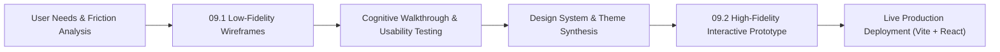
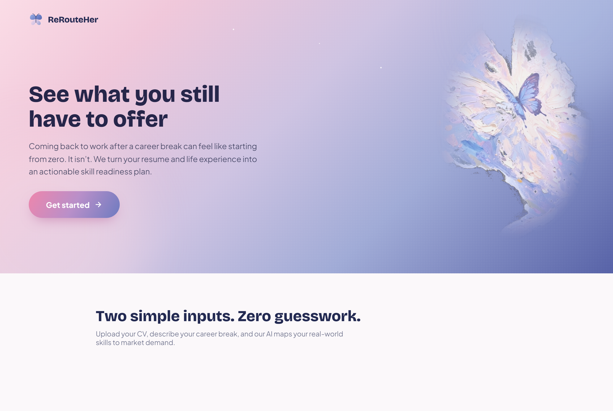
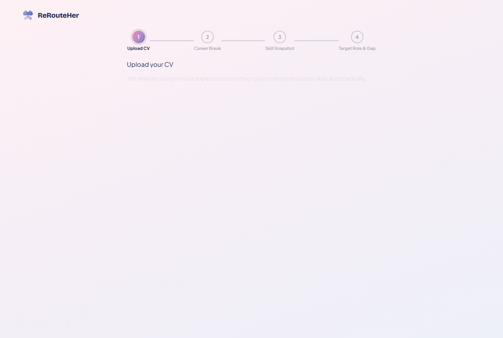
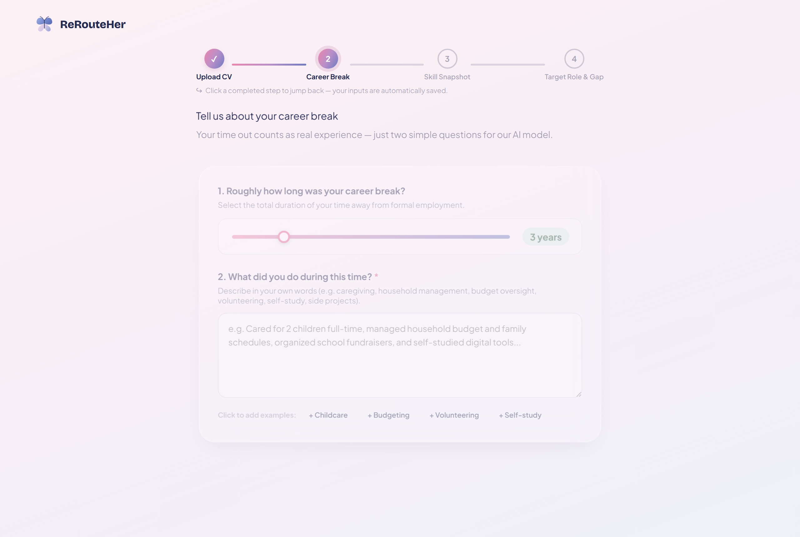
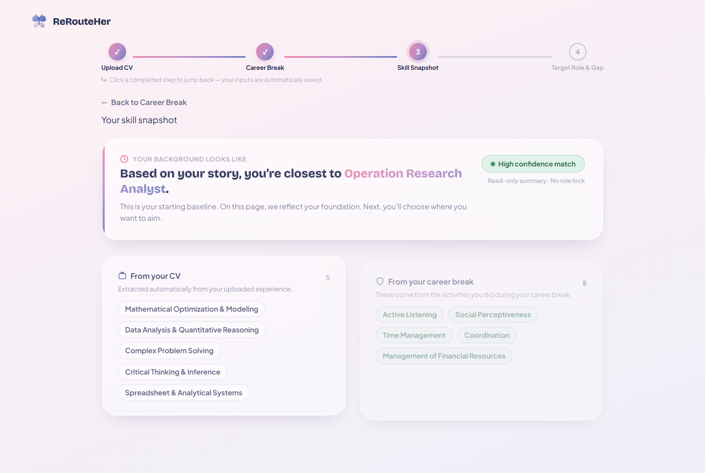
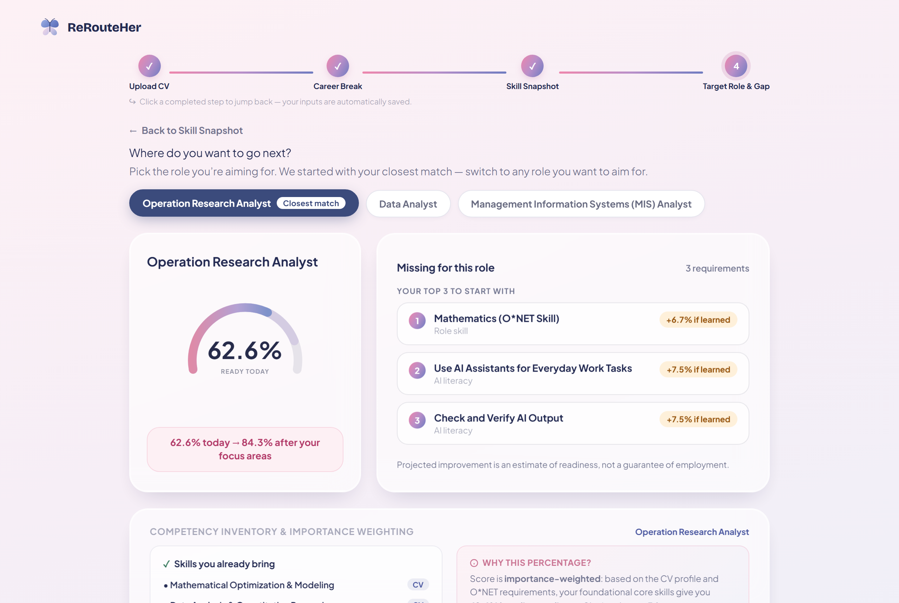
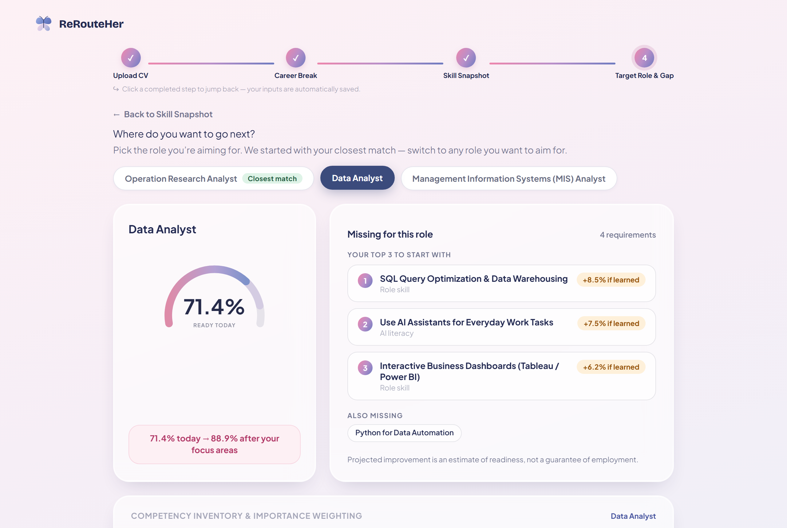
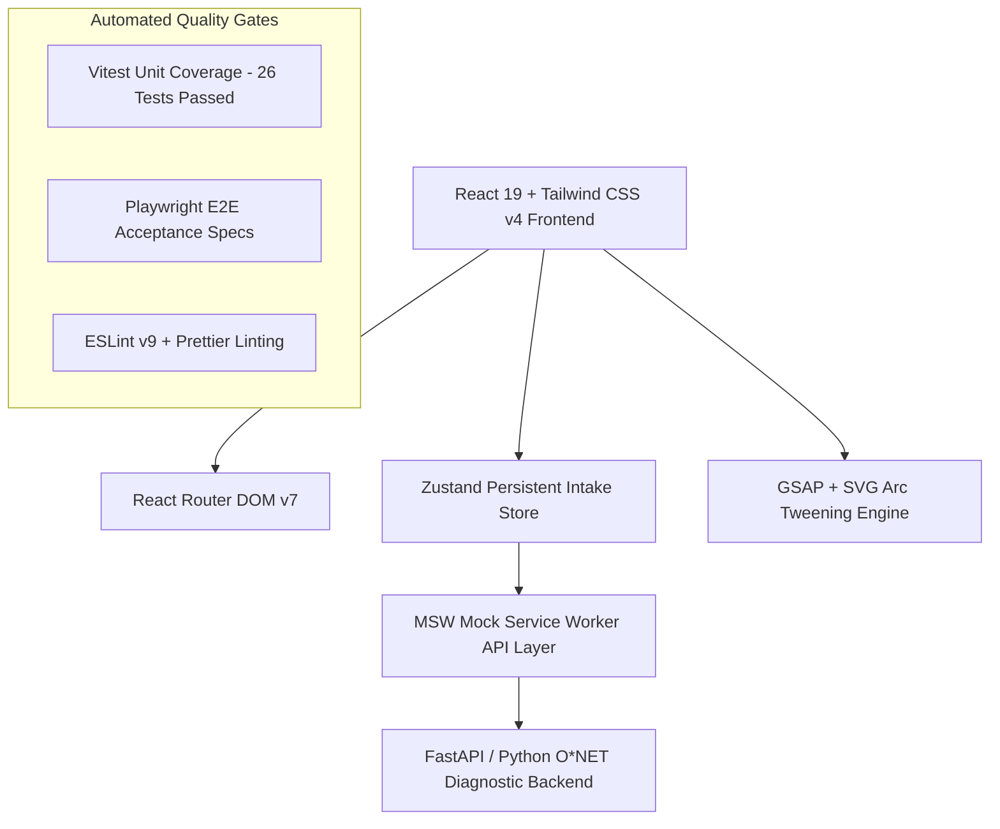

# 📱 09 · Low-Fidelity & High-Level (Hi-Fi) Interactive Prototypes

> **Project**: ReRouteHer — AI-Powered Skill Readiness & Career Re-entry Platform  
> **Course / Team Code**: `5120-TM07`  
> **Figma Canvas**: [5120-TM07 Figma Design File](https://www.figma.com/design/wwl5kUAg2RJF8anRURdf1n/5120-TM07?node-id=0-1&t=8vvvEvjkLIAUzMhL-1)  
> **Live Interactive Prototype**: [https://prototype.curl.my/](https://prototype.curl.my/)  
> **GitHub Repositories**: [`ryus0006/rerouteher-ui`](https://github.com/ryus0006/rerouteher-ui) & [`ncm233/reroutehers-prototype`](https://github.com/ncm233/reroutehers-prototype)

---

## 1. Executive Summary & Prototyping Objectives

Returning to formal employment after a prolonged caregiving career break is fraught with severe emotional and cognitive hurdles: returners frequently experience **imposter syndrome**, struggle to articulate their transferable capabilities, and encounter a **"wall of 20+ overwhelming job requirements"** on traditional job boards.

**ReRouteHer** addresses this gap through an empathy-led, data-backed career re-entry readiness engine. The prototyping phase followed an iterative double-diamond design lifecycle, progressing from conceptual low-fidelity (Lo-Fi) structural wireframes to a high-level, interactive high-fidelity (Hi-Fi) prototype.



---

## 2. Low-Fidelity (Lo-Fi) Prototypes & Wireframe Architecture

### 2.1 Design Rationale & Information Hierarchy
The initial low-fidelity wireframes established the foundational four-step sequential journey, deliberately stripping away visual embellishments to validate three core design hypotheses:
1. **Zero-Friction Intake**: Eliminating multi-page tedious questionnaires in favor of an automated 2-step input (CV document parsing + natural language career break description).
2. **Reflective vs. Exploratory Separation**: Separating the historical baseline (Skill Snapshot — where she is coming from) from the aspirational target (Target Role & Gap — where she wants to aim).
3. **Anti-Overwhelm Focus**: Guaranteeing a strict maximum cap of **3 actionable focus areas**, replacing demoralizing comprehensive requirement checklists.

### 2.2 Screen-by-Screen Lo-Fi Breakdown

| Stage | Lo-Fi Screen Name | Key Functional Modules & Layout Strategy | User Experience Intent |
| :--- | :--- | :--- | :--- |
| **01** | **Landing Page** | • Minimalist top navigation with brand mark<br>• Hero header with bold value proposition<br>• Prominent primary CTA button (`Start Your Journey`)<br>• 3-column value cards (Break Experience, Weighted Score, Top 3 Focus) | Instills immediate confidence and sets clear expectations of zero manual friction. |
| **02** | **Profile & Experience Intake** | • Drag-and-drop CV upload dropzone (PDF/DOCX)<br>• Duration selector (0.5 to 15 years)<br>• Free-text multi-line textarea with example suggestion chips | Bypasses repetitive form fields, allowing returners to express real-world experiences in their own words. |
| **03** | **Baseline Skill Snapshot** | • Non-locking 'Background Baseline' header<br>• Two-column skill container: Extracted CV Skills vs. Reframed Break Skills<br>• O*NET crosswalk indicator badge | Validates both professional achievements and caregiving competencies on an equal footing. |
| **04** | **Target Role & Gap Analysis** | • Interactive target role selector tabs<br>• Semicircular readiness gauge displaying current baseline %<br>• Capped Top 3 focus areas with projected readiness boost tags<br>• 'Explore Upskilling Paths' CTA | Replaces failure anxiety with an actionable, bite-sized growth plan. |

---

## 3. High-Fidelity (Hi-Fi) Interactive Prototype (Screen-by-Screen Direct Capture)

The high-fidelity prototype transforms the validated wireframes into a soothing, empowering, state-of-the-art interactive web application. Below are direct, unedited high-resolution captures of the live prototype implementation.

### 3.1 Design System & Visual Tokens

| Token Name | Hex Code | Tailwind / CSS Var | Semantics & Psychological Function |
| :--- | :--- | :--- | :--- |
| **Primary Blush Pink** | `#DE8BA8` | `--pink-500` | Metamorphosis, empathy, primary gradient CTA button |
| **Soft Lavender** | `#B4A2D4` | `--violet-400` | Transmutation, cognitive calming, ethereal depth |
| **Periwinkle Blue** | `#7E92CA` | `--blue-600` | Trust, professional stability, technical skill tags |
| **Mint Green** | `#337857` | `--mint-600` | O*NET validated break achievements, high confidence badge |
| **Amber Gold** | `#96540D` | `--amber-700` | Priority focus area uplift badges (+% gain) |
| **Midnight Ink** | `#262B4A` | `--ink` | High-contrast primary typography & UI structure |
| **Frosted Canvas** | `#FCF8FA` | `--grad-soft` | Multi-stop ethereal soft gradient page background |

---

### 3.2 Direct Screen Captures & Specifications

#### **Screen 1 · Landing Page (E1)**

* **Hero Artwork**: Ethereal multi-layered butterfly oil painting with radial alpha-mask gradient blending (85% opacity).
* **Journey Rail**: 3-step interactive visual progress stepper (`1. Upload CV` ➔ `2. Describe break` ➔ `3. See fit & top gaps`).
* **Parallax Dynamics**: Smooth GSAP & ScrollTrigger orbital physics and soft floating star highlights.

---

#### **Screen 2a · Step 1: Upload CV (E2a)**

* **File Dropzone**: Drag-and-drop file upload supporting `.pdf` and `.docx` (up to 10MB) with instant client-side verification.
* **1-Click Sample CV Loaders**: Pre-configured analyst and designer sample resumes for immediate friction-free evaluation.

---

#### **Screen 2b · Step 2: Career Break Intake (E2b)**

* **Question 1 (Duration Slider)**: Intuitive range slider (0.5 to 15 years) with dynamic mint tag preview.
* **Question 2 (Natural Language Textarea)**: Free-text input capturing caregiving, budgeting, volunteering, and self-study, accompanied by 4 one-tap example tags (`+ Childcare`, `+ Budgeting`, `+ Volunteering`, `+ Self-study`).

---

#### **Screen 3 · Step 3: Skill Snapshot Baseline (E3)**

* **Occupation Baseline Line**: Features an explicit headline based on the backend reranker: *“Based on your story, you're closest to **Operation Research Analyst**”* with a `High confidence match` mint badge.
* **From your CV**: Extracted career competencies rendered as compact pill chips (`SkillChip`) with hover evidence tooltips and a `Show all / Show fewer` collapse toggle.
* **From your career break**: O*NET-reframed domestic and community skills (`Active Listening`, `Social Perceptiveness`, `Time Management`, `Coordination`, `Management of Financial Resources`).
* **O*NET Crosswalk Bridge**: Informational banner illustrating automated NLP translation from everyday tasks to US Dept. of Labor taxonomies.

---

#### **Screen 4 · Step 4: Target Role & Gap Analysis (E4)**

* **Interactive Role Selector Pills**:
  - `Operation Research Analyst` (`Closest match` — active by default)
  - `Data Analyst`
  - `Management Information Systems (MIS) Analyst`
* **210° Arc Readiness Gauge**: Dynamic SVG sweep gauge indicating **`62.6% READY TODAY`** paired with a projected readiness card: **`62.6% today → 84.3% after your focus areas`**.
* **Missing for this role (Capped Top 3 Focus Areas)**:
  1. `Mathematics (O*NET Skill)` — `Role skill` — `+6.7% if learned` (Amber badge)
  2. `Use AI Assistants for Everyday Work Tasks` — `AI literacy` — `+7.5% if learned` (Amber badge)
  3. `Check and Verify AI Output` — `AI literacy` — `+7.5% if learned` (Amber badge)
* **Importance-Weighted Formula Card**: Transparently explains the scoring mechanism to demystify readiness percentages.

---

#### **Screen 4 (Variant) · Target Role Switching (Data Analyst)**

* Demonstrates instant live recalculation when switching to **Data Analyst**: readiness shifts to **71.4% Baseline ➔ 88.9% Target**, with tailored focus areas (*SQL Query Optimization*, *AI Assistants*, *Interactive Business Dashboards*).

---

## 4. Technical Prototype Architecture & Quality Assurance



### 4.1 Technology Stack Matrix
- **UI Framework**: React 19 (Functional Components & Custom Hooks)
- **Styling Architecture**: Tailwind CSS v4 + Vanilla CSS Design Tokens
- **State Management**: Zustand lightweight reactive store with local persistence
- **Animation & Transitions**: GSAP 3.12 (GreenSock) for high-performance physics-based timeline animations
- **Mock & Data Layer**: MSW (Mock Service Worker 2.15) for identical client-server REST contract emulation
- **Quality Assurance**: Vitest (Unit & Coverage) + Playwright (End-to-End browser test automation)

---

## 5. Usability Evolution & Design Refinement Log

| Iteration Phase | Identified User Pain Point / Feedback | Implemented Design Solution in Hi-Fi Prototype |
| :--- | :--- | :--- |
| **Lo-Fi Wireframe** | Generic role selection felt restrictive and forced returners into boxes prematurely. | Introduced the **Read-Only Skill Snapshot** step as a reflective baseline before prompting role selection. |
| **Initial Hi-Fi (v1.0)** | AI literacy skills flooded the focus list, crowding out essential domain technical skills. | Engineered the **`pickFocusAreas` algorithm**: guarantees 1 AI-literacy slot and reserves remaining slots for core domain role skills. |
| **User Feedback (v1.1)** | Long CV skill lists created vertical scrolling clutter and cognitive fatigue. | Created compact pill chips (`SkillChip`) with hover evidence tooltips and a `Show all / Show fewer` collapse toggle. |
| **Team Review (v2.0)** | Perceived disconnect between raw skill count (e.g. 7 of 10) and percentage readiness (62.6%). | Added the **Importance-Weighted Formula Card**, clearly explaining weighting factors and O*NET skill benchmarks. |

---

## 6. Access Links & Verification Instructions

- 🔗 **Figma Design Canvas**: [https://www.figma.com/design/wwl5kUAg2RJF8anRURdf1n/5120-TM07](https://www.figma.com/design/wwl5kUAg2RJF8anRURdf1n/5120-TM07?node-id=0-1&t=8vvvEvjkLIAUzMhL-1)
- 🌐 **Live Deployed Prototype**: [https://prototype.curl.my/](https://prototype.curl.my/)
- 💻 **Local Development Execution**:
  ```bash
  # Install dependencies
  npm install

  # Run interactive development server
  npm run dev

  # Run automated test suite
  npm run test:unit
  ```
