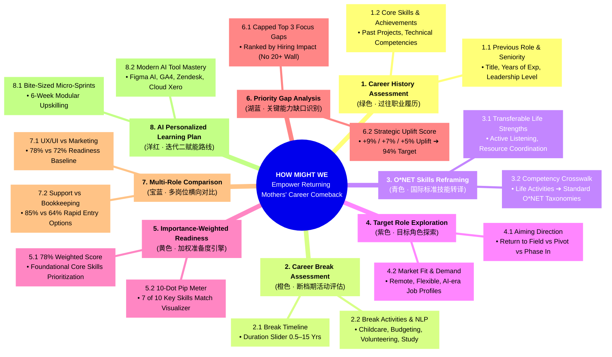

# 🌸 ReRouteHer — Lotus Blossom Strategy Diagram (九宫格莲花图)

> **Strategic Framework**: Lotus Blossom Technique (8-Petal Ideation & Architecture Mapping)  
> **Core Theme**: Mapping a Career Comeback: A Strategic Pathway for Returning Mothers  
> **Target Persona**: Experienced Malaysian mothers returning to the workforce after childcare career breaks  
> **Platform**: [ReRouteHer Live Prototype](https://prototype.curl.my/)

---

## 1. 🖼️ Lotus Blossom Diagram Visuals


---

## 2. 🎯 Core Problem Statement (Center Core: HOW MIGHT WE)

```
╔══════════════════════════════════════════════════════════════════════════════════════════════════════════╗
║                                            HOW MIGHT WE                                                  ║
║  Help experienced Malaysian mothers returning from childcare-related career breaks identify realistic   ║
║  career opportunities that reflect their previous professional experience, uncredited break activities,  ║
║  and forward-looking career aspirations?                                                                 ║
╚══════════════════════════════════════════════════════════════════════════════════════════════════════════╝
```

---

## 3. 🌺 8-Petal Lotus Blossom Decomposition (八大莲花维度分解)



---

## 4. 📊 Detailed Petal-by-Petal Strategy Matrix

| 维度编号 | 莲花花瓣主题 | 核心功能与产品实现 (ReRouteHer Implementation) | 解决的核心用户痛点 (Pain Points Solved) | 对应产品 Epic / 页面 |
| :--- | :--- | :--- | :--- | :--- |
| **01** | **1. Career History Assessment**<br>*(绿色 · 过往经历)* | • **必须上传 CV** (PDF/DOCX)<br>• 自动解析职位等级、专业成果与核心硬技能<br>• 提供示例简历一键测试 | 告别繁琐的手动表单输入，自动提取过往职业资产 | **E2a · Upload CV** |
| **02** | **2. Career Break Assessment**<br>*(橙色 · 断档期)* | • **时长滑块** (0.5~15 年)<br>• **自然语言自由文本输入 (NLP Textarea)**<br>• 包含育儿、家庭理财、社区义工、自学等辅助标签 | 消除传统招聘对“职业空白期”的歧视，肯定无偿照护的社会价值 | **E2b · Career Break** |
| **03** | **3. O*NET Skills Reframing**<br>*(青色 · 技能转译)* | • **O*NET 跨界转换横幅**<br>• 将带娃/管家转译为*“危机化解、多项目时间调度、预算管理”*<br>• 形成只读历史基准 | 帮助妈妈们发现自身隐藏的通用技能（Transferable Skills） | **E3 · Skill Snapshot** |
| **04** | **4. Target Role Exploration**<br>*(紫色 · 目标探索)* | • 4 个预设目标角色（UX/UI、数字营销、客户支持、财务出纳）<br>• 标明 *“Closest Match”* 建议，支持自由切换 | 从“我能做什么”转变为“我想去哪里”，赋予主动选择权 | **E4 · Target Role** |
| **05** | **5. Importance-Weighted Readiness**<br>*(黄色 · 加权评分)* | • **Lieflat 弧形仪表盘** (78% 实时动画)<br>• **10 格点阵图** (7/10)<br>• **透明公式解释**：核心基本功权重高，所以 7/10 产生 78% 准备度 | 消除黑盒算法疑虑，明确解释为什么自己已经具备 78% 准备度 | **E4 · Readiness Card** |
| **06** | **6. Priority Gap Analysis**<br>*(湖蓝 · 缺口攻坚)* | • **锁定 Top 3 核心攻坚项**（绝不列出 20+ 条冗长要求）<br>• 每项标注 **+9% / +7% / +5% 增益标签**<br>• 目标提升至 **94% 达标分** | 避免信息过载与挫败感，聚焦回报率最高的 3 项技能 | **E4 · Top 3 Focus Gaps** |
| **07** | **7. Multi-Role Comparison**<br>*(宝蓝 · 岗位横向比)* | • **Senior UX/UI** (78% ➔ 94%)<br>• **Digital Marketing** (72% ➔ 91%)<br>• **Customer Support** (85% ➔ 97%)<br>• **Bookkeeping** (64% ➔ 91%) | 横向评估转岗难度与快速切入点，制定多路径备选方案 | **E4 · Role Switcher** |
| **08** | **8. AI Personalized Learning Plan**<br>*(洋红 · 学习路线)* | • **迭代二规划**：6 周微冲刺学习计划<br>• 聚焦现代 AI 生产力工具（Figma AI、GA4、Zendesk AI、Xero Copilot） | 提供切实可行的闭环解决方案，从诊断直接过渡到能力提升 | **E5 · Learning Sprints** |

---

## 5. 💡 总结与战略价值

通过该 **Lotus Blossom Strategy Diagram**，ReRouteHer 成功将重返职场妈妈面临的复杂挑战拆解为：
1. **输入层（Input）**：简历专业技能 + 断档生活经历（自由文本 NLP）。
2. **算法层（Engine）**：O*NET 标准化转译 + 重要性加权评分引擎。
3. **呈现层（Output）**：透明可视化准备度仪表盘 + Top 3 限制展示核心缺口。
4. **行动层（Action）**：6 周微冲刺学习路线与 94% 达标预期。
