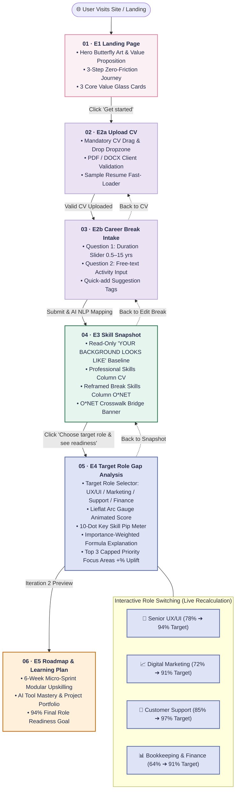
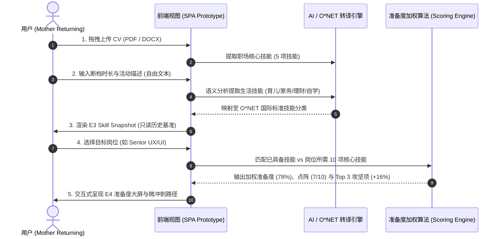

# 🗺️ ReRouteHer — Complete Site Map & Information Architecture

> **Product**: ReRouteHer (Skill Readiness & Career Re-entry Platform)  
> **Live Prototype**: [https://prototype.curl.my/](https://prototype.curl.my/)  
> **Figma Canvas**: [Figma Project Board](https://www.figma.com/design/s0GLSGeOmrg1YhWhs3mIUd/Untitled?node-id=0-1&t=atdKdT2sKp6tFob8-1)  
> **Repository**: [`ncm233/reroutehers-prototype`](https://github.com/ncm233/reroutehers-prototype) / [`ryus0006/rerouteher-ui`](https://github.com/ryus0006/rerouteher-ui)

---

## 1. 🌟 High-Level Visual Site Map


---

## 2. 🧭 Interactive User Journey Flowchart (Mermaid)



---

## 3. 📑 Comprehensive Information Architecture (IA) Matrix

| 步骤编号 | 视图 ID | 页面名称 / 模块 | 用户目标 (User Intent) | 核心输入 / 交互组件 (Inputs) | 核心展示 / 输出数据 (Outputs) | 系统逻辑与状态 (System State) |
| :--- | :--- | :--- | :--- | :--- | :--- | :--- |
| **01** | `landing` | **E1 Landing Page** | 了解平台定位，建立重返职场信心，无门槛启动体验 | • 头部导航 Logo<br>• `Get started` 主行动按钮 (CTA)<br>• 滚动体验视差交互 | • 梦幻通透油画蝴蝶艺术图<br>• 核心主张与 3 步旅程流程<br>• 3 大价值玻璃卡片 | 初始化 Guest 临时会话，重置滚动监听 |
| **02** | `story-a` | **E2a Upload CV** | 提交过往职业履历，提取基础技能 | • 简历拖拽上传区 (PDF/DOCX)<br>• `⚡ Load Sample CV` 示例简历<br>• `Continue` 继续按钮 | • 文件名与文件大小校验提示<br>• 成功上传绿色状态卡片 | 强制上传校验（不可跳过），解析文件元数据 |
| **03** | `story-b` | **E2b Career Break** | 记录职场空窗期时长与真实生活活动 | • 休息时长滑块 (0.5~15 年)<br>• **自由文本输入框 (Textarea)**<br>• 4 个快捷活动辅助标签 | • 动态时长气泡 (`3 years`)<br>• 实时自动保存提示 | 提取自由文本中的关键词并映射至 O*NET 技能词库 |
| **04** | `snapshot` | **E3 Skill Snapshot** | 查看过往职场技能与生活技能的转译基准 | • `← Back to Break` 修改断档<br>• `Choose target role` 瞄准按钮 | • **`YOUR BACKGROUND LOOKS LIKE`** 基准卡<br>• 职场专业技能栏 (5 项)<br>• 生活转译技能栏 (O*NET 校验)<br>• O*NET 跨界转换横幅 | 纯只读展示，不锁定用户目标岗位 |
| **05** | `gap` | **E4 Target Role & Gap** | 探索不同目标岗位的匹配度与 3 大优先攻坚项 | • 4 个岗位切换选择 Pills<br>• `← Back to Snapshot` 返回基准 | • **Lieflat 弧形仪表盘** (实时百分比动画)<br>• **10 格技能点阵** (如 7/10)<br>• **加权准备度公式解释卡**<br>• **78% ➔ 94% 目标提升胶囊**<br>• **Top 3 聚焦项** (按 +% 增益排序) | 动态计算加权匹配分，支持 4 岗位秒级切换与重绘 |
| **06** | `preview` | **E5 Roadmap (Iteration 2)** | 规划后续学习冲刺路线 | • 查看路线图大纲 | • 6 周微冲刺路线预览与 94% 达标预期 | 迭代二规划入口，提供后续产品演进展望 |

---

## 4. 🎯 目标岗位状态分支矩阵 (E4 Role Variants Matrix)

```
┌─────────────────────────────────────────────────────────────────────────────────────────────┐
│ E4 Target Role Readiness Engine                                                             │
├──────────────────────┬─────────────┬──────────────┬──────────────┬──────────────────────────┤
│ 目标角色 (Role)       │ 当前准备度   │ 最终目标分   │ 核心技能点阵 │ Top 3 攻坚项 (+% Uplift) │
├──────────────────────┼─────────────┼──────────────┼──────────────┼──────────────────────────┤
│ 🎨 Senior UX/UI      │ 78% (基准)  │ 94% (目标)   │ 7 / 10 命中  │ • AI Design (+9%)        │
│                      │             │              │              │ • Design Systems (+7%)   │
│                      │             │              │              │ • Prompt UX (+5%)        │
├──────────────────────┼─────────────┼──────────────┼──────────────┼──────────────────────────┤
│ 📈 Digital Marketing │ 72%         │ 91% (目标)   │ 7 / 10 命中  │ • AI-Driven SEO (+8%)    │
│                      │             │              │              │ • GA4 Analytics (+6%)    │
│                      │             │              │              │ • Ad Automation (+5%)    │
├──────────────────────┼─────────────┼──────────────┼──────────────┼──────────────────────────┤
│ 💬 Customer Support  │ 85%         │ 97% (目标)   │ 8 / 10 命中  │ • Zendesk Omnichannel(+7%)│
│                      │             │              │              │ • AI Copilot Triage (+6%)│
│                      │             │              │              │ • CRM Health Risk (+4%)  │
├──────────────────────┼─────────────┼──────────────┼──────────────┼──────────────────────────┤
│ 📊 Bookkeeping       │ 64%         │ 91% (目标)   │ 6 / 10 命中  │ • Cloud Xero/QB (+12%)   │
│                      │             │              │              │ • AI Sheets Copilot (+9%)│
│                      │             │              │              │ • Tax Compliance (+6%)   │
└──────────────────────┴─────────────┴──────────────┴──────────────┴──────────────────────────┘
```

---

## 5. 🎨 Figma 画布与代码文件层级对应关系

根据 [Figma 画板链接](https://www.figma.com/design/s0GLSGeOmrg1YhWhs3mIUd/Untitled?node-id=0-1&t=atdKdT2sKp6tFob8-1) 与本地脚本 [`figma-plugin/code.js`](file:///e:/reroutehers-prototype/figma-plugin/code.js) 的组织架构：

```text
🎨 Figma Master Project Structure
│
├── 🌟 00 · Design Tokens & UI Kit (Colors, Typographic Scale, Atoms)
│
├── 🖥️ 核心业务画板 (1:1 对应 assemble-app.mjs)
│   ├── 01 · E1 Landing Page (Hero + 3-Step Journey + 3 Glass Cards)
│   ├── 02 · E2a Upload CV (Dropzone + PDF/DOCX Validation + Sample CV)
│   ├── 03 · E2b Career Break (Duration Slider + Free-text NLP Input)
│   ├── 04 · E3 Skill Snapshot (Read-Only Baseline + O*NET Crosswalk)
│   └── 05 · E4 Target Role: Senior UX/UI (78% ➔ 94% + Lieflat Gauge)
│
└── 🔄 目标岗位拓展分支 (Variants)
    ├── 06 · E4 Target Role: Digital Marketing (72% ➔ 91%)
    ├── 07 · E4 Target Role: Customer Support (85% ➔ 97%)
    └── 08 · E4 Target Role: Bookkeeping & Finance (64% ➔ 91%)
```

---

## 6. 🧠 核心数据流与 AI 技能转译逻辑 (Data Architecture)


